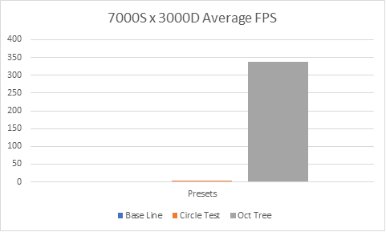

Engine Algorithms
=================

Tim Akerman (448470)

EGE2a

Contents
========

[Engine Algorithms 1](#engine-algorithms)

[Introduction 3](#introduction)

[Initial Version 4](#initial-version)

[Sphere Test hypothesis 5](#sphere-test-hypothesis)

[Octree Hypothesis 6](#octree-hypothesis)

[Combination 7](#combination)

[Conclusion 8](#conclusion)

Introduction
============

This paper presents a real time collision detection implementation that
can detect collisions between dynamic and static oriented bounding boxes
in \[BIG O HERE\] time. For the paper every complexity calculation will
be denoted in big-O notation. The main part is structured in different
hypotheses that are all proven by themselves. In the end I will conclude
and show the total complexity reduced as well as the result. For each
hypothesis I will present relevant charts in different situations.

Initial Version
===============

The starting point for this paper is a collision detection algorithm
that checks all moving objects against all moving and all static objects
with the Separating Axis Theorem (further denoted by SAT). The algorithm
has a complexity  and works
reasonably well when the number of objects is small.

Comparison: Algorithm gets unusable slow when the number of colliders
gets reasonably big

Worst Case:

Colliders are all dynamic. The algorithm must check
 times.

Best Case:

There is no Dynamic collider. The algorithm must check
 
times.

Sphere Test hypothesis
======================

A sphere test has the potential to vastly increase the computing
performance, since a simple range condition is fast compared to the SAT
Algorithm. With a few other improvements (such as not using square root
and just storing the squared radius) the algorithm gets a lot faster.

Comparison: At 500 Static and 500 Dynamic colliders the sphere test
accelerates the algorithm up to 200%

Worst Case:

All objects are in radius of each other. That renders the sphere test
without any impact.

Best Case:

All the objects are at least the bounding spheres radius apart from each
other.

Octree Hypothesis
=================

Instead of organizing all the colliders in arrays we could also
subdivide space recursively to bring down the amount of possible
collisions to a checkable size. In this implementation I decided for a
"Leaf only" octree. An Octree is a spatial hashing data structure that
can search its leaf nodes in worst case  time.
Since an octree is subdividing itself in 8, an octree with depth level N
has a maximum of leaf nodes . Keep in mind
that this is the theoretical distance. The implementation in this paper
is creating the nodes as they are needed to save memory on unused nodes.
Because its possible for an object to be in multiple leaves at once,
each leaf will have a reference to the intersecting objects. The
collision manager now loops through all the leaf nodes and does the
normal collision checking algorithm that was used before. In case the
leaf node got exited by the last object, it has 15 frames of cooldown
until it gets removed from the leaf nodes to minimize unnecessary for
loop cycles. Every frame it is checked with a simple AABB check if the
dynamic object is still in the node it was a frame before. If so, we can
safely skip moving the dynamic collider up the tree since, it can not be
anywhere else than in the leaf that it is now.

Comparison: Average FPS. Base line is completely invisible. Circle test
is barely visible. Octree is at depth level 4.

As we can see, the octree is accelerating the algorithm by about 99,7%
because of its advanced data structure that gives a clear advantage over
checking everything in the whole game scene.

Worst Case:

> The tree is highly unbalanced (all the points are for example in the
> top left subtree. This makes the Octree work like a linked list.

Best Case:

> The tree is highly balanced (all the nodes have equal number of
> colliders). This leads to an effectively up to seven times smaller
> search size after each iteration.

Combination
===========

When the two hypothesis explained above are combined, the performance is
increasing again. Not by as much as they are accelerating on their own.
While the octree is ensuring a small checking size for each leaf, the
sphere test can further increase the performance if the radius is
smaller than the octrees lowest level extends. If the radius is bigger
or equal, the algorithm slows down compared to a non-sphere testing
implementation, since the sphere test is enclosing the whole testing
area.

Combined Sphere Test and Octree level 4 is giving another \~40 fps
boost.

On a smaller scale the Oct Tree and the combined performance is
misleading because there are about 2 leaf nodes per object. Thus, a
collision (or even close) is uncommon.

Conclusion
==========

Collision detection is one of the core requirements to qualify as a
game. Due to the number of colliders and the available compute time (one
frame) engineers must come up with new, faster approaches. In most of
the cases a sphere test before a more complicated collision tests are
more than enough for most games. But if you need a highly efficient
collision detection method, there is no way around trees and their
culprits.
